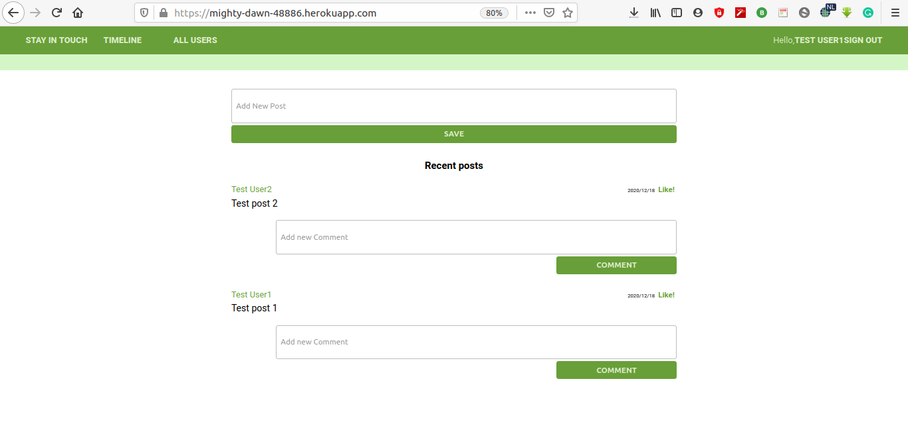
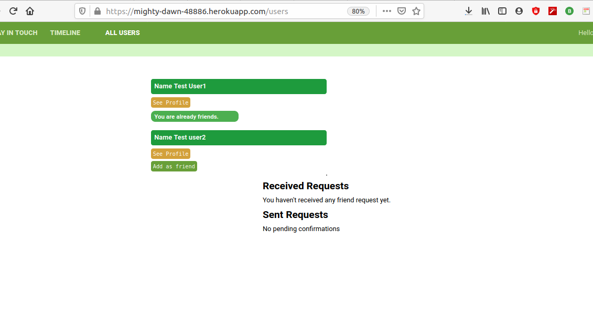

# Scaffold for social media app with Ruby on Rails

> Project to do a social media app: You can sign up with email and password and then create posts, add other user as friends, read the post of your friends, comment and give them a like.





## Built With

- Ruby v2.7.0
- Ruby on Rails v6

## Tested With

- Rubocop
- Rspec

## Prerequisites

- Ruby
- Rails
- Postgres

## Live Demo

[Stay in touch](https://mighty-dawn-48886.herokuapp.com/users/sign_in)

### Setup

Instal gems with:

```
bundle install
```

Setup database with:

```
   rails db:create
   rails db:migrate
```

### Github Actions

To make sure the linters' checks using Github Actions work properly, you should follow the next steps:

1. On your recently forked repo, enable the GitHub Actions in the Actions tab.
2. Create the `feature/branch` and push.
3. Start working on your milestone as usual.
4. Open a PR from the `feature/branch` when your work is done.


### Usage

Start server with:

```
    rails server
```

Open `http://localhost:3000/` in your browser.

### Run tests

```
    rpsec --format documentation
```

> Tests will be added by Microverse students. There are no tests for initial features in order to make sure that students write all tests from scratch.

### Deployment

-- In order to deploy this app to Heroku follow the steps below.

- Install the Heroku CLI.

- After that type the command to create the app and add the heroku repository to your project.

- `heroku create`

- Then `git push -u heroku yourbranch:master` to deploy the app.

- Replace yourbranch with the name of your branch.

- Finally run the command to create your database and tables on Heroku's server.

- `heroku run rails db:migrate`

- Enjoy the App functionalities.


## Authors

### Author 1

👤 **Roy Mukuye**

- GitHub: [@mke2111](https://github.com/mke2111)
- Twitter: [@Roymkenya](https://twitter.com/Roymkenya)
- LinkedIn: [Roy Mukuye](https://www.linkedin.com/in/roy-mukuye-42b07b1b4)

### Author 2

👤 **Eduardo Baeza**

- GitHub: [@edxco](https://github.com/edxco/)
- Twitter: [@lalo_nbc](https://twitter.com/lalo_nbc/)
- LinkedIn: [eduardo-n-baeza](https://www.linkedin.com/in/eduardo-n-baeza/)

## 🤝 Contributing

Contributions, issues and feature requests are welcome!

Feel free to check the [issues page](issues/).

## Show your support

Give a ⭐️ if you like this project!


